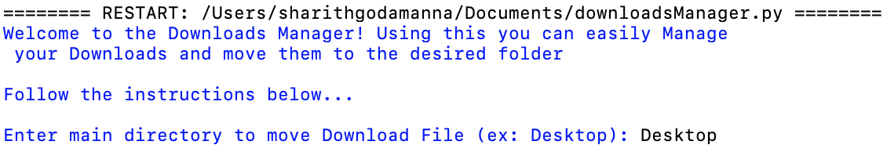

# Download Manager

Python program that manages Downloads

This is a Python program which manages a users Downloads easily.

Have you ever downloaded a bunch of files and have to copy and paste them into the desired foler? (ex lecture notes which need to be moved from Downloads into Desktop/LectureNotes).

In Mac you are not allowed to Cut and paste the folders, so the user has to copy, paste, and the move to trash, which is a process. Additionaly, if you want to rename your file, you have to go one by one and rename each file.

Luckily the os library in Python allows for direct access to files and folders, so i tried to make this process easier by creating this program. Below i will explain each function and main lines of code which do this task.

## **Function 1: main()**

---

### **Gets the user input for which directory they want to move the downloads folder to. Ex: if you want to move the contents from the Downloads folder into a folder in the Desktop.**

### Input Prompt

```Python
move_dir = str(input("Enter main directory to move Download File (ex: Desktop): "))
cwd = os.path.expanduser("~/Downloads/")
move_dir = move_dir[0].upper() + move_dir[1:]
mvdir = os.path.expanduser("~/"+move_dir+"/")
```

### Output



- <code>move_dir: </code> A variable that holds the directory where the Download file must go.
- <code>cwd (current working directory): </code> Stores the path of the Download directory, this is fixed as we are moving files from Downloads to external directories.

How do we get this path?

```Python
cwd = os.path.expanduser("~/Downloads/")
```

<code>os.path.expanduser</code> method in Python is used to expand an initial path component ~( tilde symbol) or ~user in the given path to user’s home directory.

Excerpt from [Geeks for Geeks](https://www.geeksforgeeks.org/python-os-path-expanduser-method/)

So <code>cwd</code> becomes:

```Python
cwd = '/Users/[username]/Downloads/'
```

This is important to understand as in the next line we concetonate <code>move_dir</code> into the <code>os.path.expanduser</code> so the user can choose a custom directory, rather than bein restricted to one, like Documents.

```Python
mvdir = os.path.expanduser("~/"+move_dir+"/")
```

Quick: If you are wondering what this line does:

```Python
move_dir = move_dir[0].upper() + move_dir[1:]
```

It allows the user to enter either "Documents" or "documents" as the <code>os.path.expanduser</code> will only allow for the directory name with caps.

---

## **Gets the user input for which folder they want to move the Downloads file into.**

```Python
folder_name = str(input("Enter folder name: "))
print("If folder exists, file will be moved, if not new folder will be crated")

mvdir += folder_name

if not os.path.exists(mvdir):
    os.makedirs(mvdir)
```
